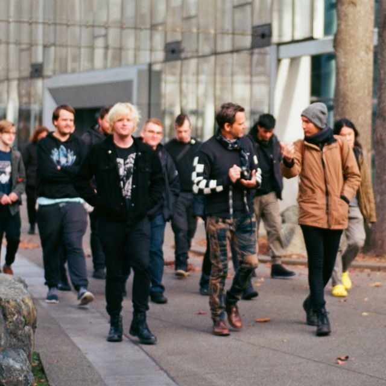

## Introductions
This space is an archive of my [[creations]], the [[places]] I've been, and the [[experiences]] that have shaped me. View my [[articles]] It's a home for reflections, creative experiments, and curated notes. Here, I collect fragments of thought, track ongoing projects, and preserve moments that might otherwise fade with time.

In keeping with the ethos of [[Merveilles]][^1], the design of this space embraces a minimalism and accessibility. To uphold these principles, I have intentionally avoided JavaScript to ensure the site remains lightweight, fast, and functional across a wide range of devices and browsers.

### A System for Knowledge
This space is generated by [[Ordinal]][^2], a custom-built static site generator written in Python. Ordinal processes content structured in Markdown, extracting metadata from frontmatter and transforming it into interconnected web pages. The system uses Jinja2 templates to dynamically render each page, ensuring a consistent structure while allowing for flexible layouts. Styling is handled with Dart SCSS, compiling stylesheets for an optimized, responsive design.

I have spent years refining my approach to knowledge management. It started with Vimwiki, a simple plaintext system. As my notes grew, I moved through 11ty, Dendron, and other solutions, looking for something that could scale with the volume. None of them worked the way I wanted, so I built something that did.

Ordinal is hypertext-first. Wikilinks resolve into bidirectional references, structuring information dynamically rather than imposing a fixed hierarchy[^3]. Metadata enables categorization, sorting, and filtering. The result is an archive that functions more like a network of thought than a static list of pages.

### A System for Time

[[Seraph]] is a system I built for mapping effort, tracking focus, and refining workflows. It doesn’t just log hours, it categorizes work across **domains**, and **divisions**. 

It started as a simple habit, adding timestamps and metadata to Markdown files to track why I wrote something, not just when. Patterns started to emerge. Focus cycles, bursts of productivity, periods of distraction, projects that branched off or stalled entirely.

From there, I automated it. Frontmatter became structured data. Python scripts process logs into sortable, queryable datasets. Over time, effort can be analyzed. Where time is spent, where context-switching disrupts flow, where work disappears without a trace.

Tools like Chronologicon[^4] structure this data over time, while Obsidian’s interlinking ensures past efforts remain accessible. What started as an ad-hoc system became a framework for analyzing time, refining workflows, and identifying where attention is actually going.

Eventually, I integrated it into Ordinal, allowing dynamic parsing of work sessions, project timelines, and effort distribution. Seraph is no longer just a ledger. It is a diagnostic tool that helps refine how I work.

### Closing

What started as a private system has found its way here. Some entries are clean, others are rough, but they all exist because they serve a function.

Happy exploring.

— Aleph

Check out [my site](https://example.com) for more info.
Check out [my site](https://example2.com) for more info.
Check out [my site](https://example3.com) for more info.
## About Me
I'm Aleph, a multidisciplinary developer and creator driven by design, storytelling, and interactive systems. My work spans software engineering, game development, and design.

In my professional life, I've worked in IT Operations and DevOps within large enterprise settings, building reliable systems in Python, orchestrating automation with Ansible, and monitoring infrastructure with Prometheus and Grafana. I’ve built and maintained CI/CD pipelines with Jenkins and Bitbucket, deployed containerized applications using Docker, Podman, and Kubernetes, and enforced infrastructure-as-code practices with Puppet.

Beyond enterprise work, I’ve contributed to smaller, experimental projects. I maintained web infrastructure and developed asset pipelines for [Evil-Algorithm](https://evil-algorithm.com/), a VFX studio focused on immersive world design. There, I built workflows to streamline integration between third-party tools, optimizing their creative pipeline.

Currently, I am working on undisclosed project with [Drednorzt](https://www.norzt.net/) under the team name "Creation", a space where we experiment with interactive media, procedural systems, and emergent storytelling.

### A System I Shape

I build systems that react. Systems where meaning isn’t dictated, it emerges.

In software, game design, or storytelling, I’m drawn to emergence and user agency. The idea that complexity can arise from simple interactions, that a well-designed system doesn’t just deliver content but allows the user to shape their own experience within it. These concepts aren’t just interesting to me, they influence how I approach development.

**Emergent narratives** fascinate me because they aren’t written in advance; they arise through interaction. A procedural world that reacts to the player, a knowledge base that grows through interlinked ideas, an automation system that adapts based on input. Each one becomes **more than the sum of its parts** because the user isn’t just consuming information, they’re influencing its form. The most compelling experiences aren’t static; they evolve based on the choices made within them.

This ties directly into user agency. The ability to shape an experience rather than passively follow a predetermined path. It is what separates passive design from interactive design. A system that allows for exploration, experimentation, and decision-making is always more compelling than one that simply presents fixed content.

At its core, everything I develop is about **building frameworks that respond rather than dictate**. And create systems where structure exists, but the experience is shaped by the user.

### Travel & Experience

I grew up in a small town in Georgia. The kind of place where you knew every backroad by instinct and could predict who would be at the gas station on any given night. I did not really expect to go much farther than that but I desperately wanted to. So, at 18 years old I moved to Japan.

I had never traveled before. I did not know the language, the culture, or the people. All I had was a vague idea and a connection to a stranger I had met online. Someone who gave me a place to stay, helped me figure out the logistics, and made it possible. Somehow, it worked out. [^5]

Japan was precision. Designed for efficiency, structured for flow. Trains, vending machines, city grids. Everything optimized for movement. Italy was layered history. Ancient streets repurposed, the past shaping the present in different ways. I spent time in Mestre, Florence, and Naples. Naples was my favorite. Ukraine had a different vibe. A sense of place that felt earned.

I have spent time in Malta, visited England, passed through France, Turkey, and Germany. Camped in Canada, but that barely counts. It is like walking next door.

In the US, I have lived in Florida, Texas, Oregon, and soon Washington. Some places felt familiar the second I arrived. Others made me rethink movement, structure, and how people shape their environments.

[^1]: Merveilles is a loosely connected community focused on minimalism, sustainable technology, and creative independence. Inspired by solarpunk, permacomputing, and the handmade web, it emphasizes building things that are lightweight, resilient, and accessible.

[^2]: Ordinal was built out of frustration with existing tools. Many static site generators either overcomplicated simple tasks or lacked essential features I needed. Writing my own gave me full control over how it structures content, handles metadata, and integrates with my workflow.

[^3]: The use of [[wikilinks]] in Markdown is inspired by systems like TiddlyWiki and Obsidian. They allow for non-linear, interlinked writing, where ideas surface dynamically rather than being buried in a rigid folder structure.

[^4]: Chronologicon is a time tracking application that output JSON, I was originally forked that and started parsing the JSON down into a frontmatter format used in my notes.

[^5]: Moving to Japan at 18 was not a structured plan. I had no language skills, no savings, and no fallback. It worked out largely due to the kindness of people I met along the way.

